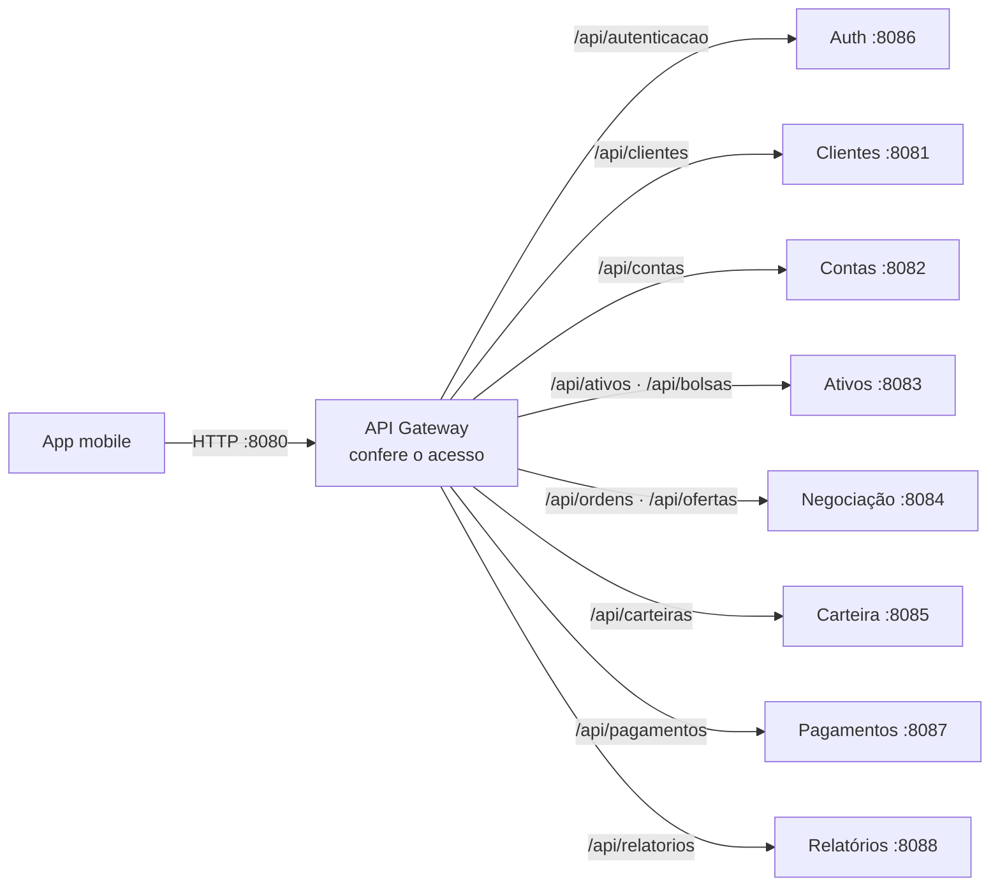
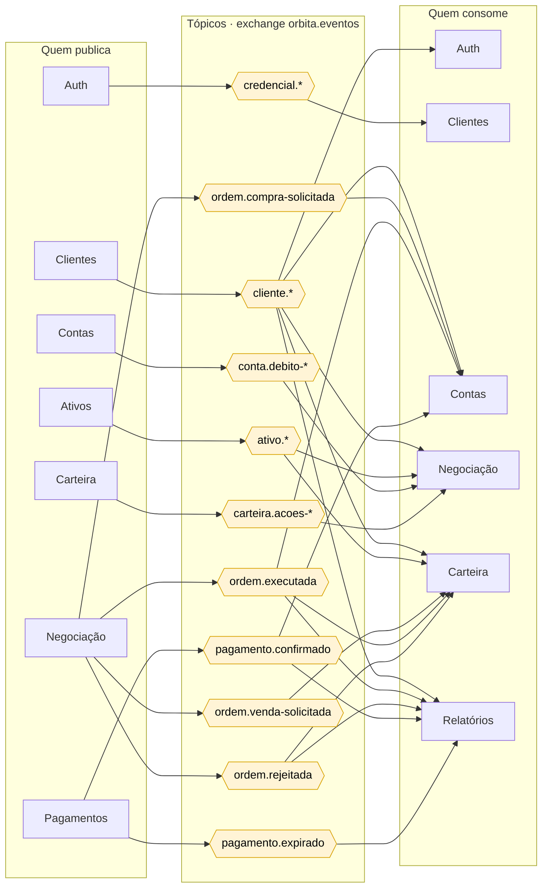
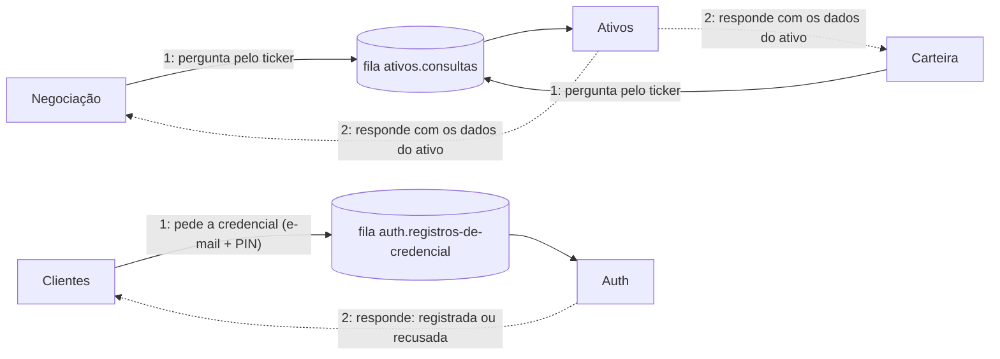
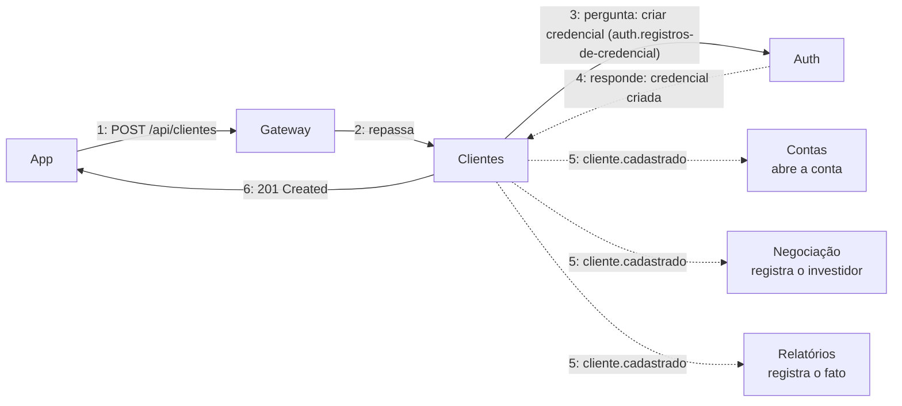
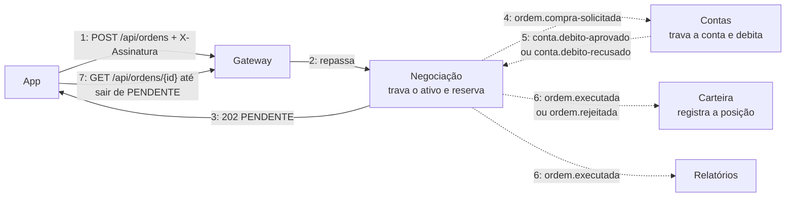
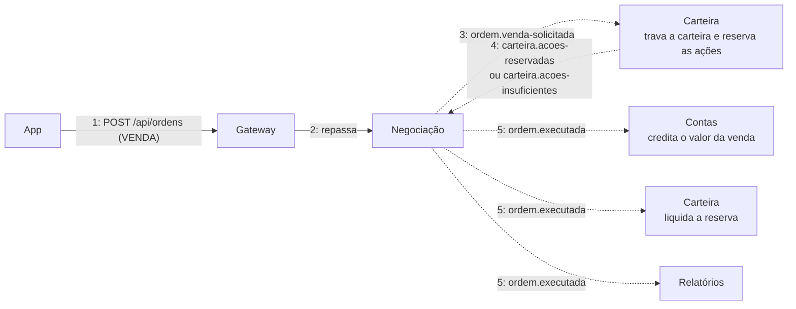
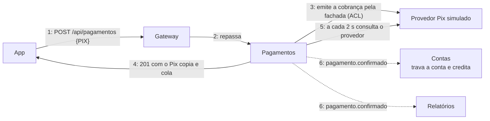

# Comunicação do ecossistema

Existem só três formas de comunicação no OrbitaPay:

| Forma | Quem usa | Como funciona |
|---|---|---|
| **HTTP** | App → Gateway → microserviço | O app só conhece o gateway. O gateway confere o acesso e repassa a requisição ao microserviço dono da rota. |
| **Evento (publica/assina)** | microserviço → RabbitMQ → microserviços | Quem publica envia para a exchange `orbita.eventos` com um tópico. Cada serviço interessado tem uma fila que assina aquele tópico. Quem publica não sabe quem vai receber. |
| **Consulta (request/reply)** | microserviço → RabbitMQ → microserviço | Quando um serviço precisa de uma resposta na hora, ele envia uma pergunta para uma fila e espera a resposta (*direct reply-to*). Também passa pelo RabbitMQ, nunca por HTTP. |

Os IPs e portas de cada container estão em [enderecos.md](enderecos.md). As filas e tópicos podem ser vistos ao vivo no painel http://localhost:8090.

## 1. Visão geral

A visão geral está dividida em três partes, uma para cada forma de comunicação.

### 1.1 HTTP: o app só fala com o gateway

### 1.2 Eventos: quem publica, o tópico e quem consome

Leia da esquerda para a direita: o serviço da esquerda **publica** o tópico do meio na exchange `orbita.eventos`, e cada serviço da direita **recebe uma cópia** pela sua própria fila.

### 1.3 Consultas: pergunta e resposta pelo RabbitMQ

Cada microserviço também fala com **o seu próprio MongoDB** (`mongo-clientes`, `mongo-contas`…). Nenhum serviço acessa o banco de outro.

## 2. Diagramas de comunicação dos fluxos principais

Nos diagramas abaixo, cada seta tem um **número de ordem**, como no diagrama de comunicação da UML: siga os números para entender a sequência.

### 2.1 Cadastro de cliente

Se o Auth recusar o PIN (passo 4), Clientes desfaz o cadastro e nada é publicado.

### 2.2 Compra de ações (saga)

Se o débito for recusado (passo 5), a Negociação **devolve a reserva** ao estoque e publica `ordem.rejeitada` (compensação da saga).

### 2.3 Venda de ações (saga)

### 2.4 Depósito (Pagamentos + camada anticorrupção)

## 3. Todos os eventos

| Tópico | Publica | Consome | Para quê |
|---|---|---|---|
| `credencial.bloqueada-por-pin` | Auth | Clientes | bloquear o cliente após 3 PINs errados |
| `cliente.cadastrado` | Clientes | Contas, Negociação, Relatórios | abrir a conta, registrar o investidor e o fato |
| `cliente.atualizado` | Clientes | Auth, Contas, Relatórios | atualizar e-mail e nome |
| `cliente.situacao-alterada` | Clientes | Auth, Contas, Negociação, Relatórios | bloquear/desbloquear em todos os contextos |
| `cliente.removido` | Clientes | Auth, Contas, Negociação, Carteira, Relatórios | encerrar tudo do cliente |
| `ativo.listado` · `ativo.atualizado` | Ativos | Negociação, Carteira | manter a cópia local do ativo |
| `ativo.removido` | Ativos | Negociação, Carteira | tirar o ativo de negociação |
| `ativo.cotacoes-atualizadas` | Ativos (a cada 3 s) | Negociação, Carteira | atualizar as cotações |
| `ordem.compra-solicitada` | Negociação | Contas | debitar o valor da compra |
| `ordem.venda-solicitada` | Negociação | Carteira | reservar as ações vendidas |
| `ordem.executada` | Negociação | Contas, Carteira, Relatórios | creditar a venda, registrar a posição, contabilizar |
| `ordem.rejeitada` | Negociação | Carteira, Relatórios | devolver a reserva de venda, contabilizar |
| `conta.debito-aprovado` · `conta.debito-recusado` | Contas | Negociação | continuar ou compensar a saga de compra |
| `carteira.acoes-reservadas` · `carteira.acoes-insuficientes` | Carteira | Negociação | continuar ou cancelar a saga de venda |
| `pagamento.confirmado` | Pagamentos | Contas, Relatórios | creditar o depósito, contabilizar |
| `pagamento.expirado` | Pagamentos | Relatórios | contabilizar a cobrança expirada |

| Consulta (request/reply) | Pergunta | Responde | Para quê |
|---|---|---|---|
| `ativos.consultas` | Negociação, Carteira | Ativos | dados de um ativo que ainda não está na cópia local |
| `auth.registros-de-credencial` | Clientes | Auth | criar a credencial (PIN) no cadastro |

Se o consumo de uma mensagem falhar 3 vezes, ela vai para a exchange `orbita.eventos.mortos` e cai na **DLQ** do serviço (`contas.dlq`, `negociacao.dlq`…), em vez de ficar em loop.
