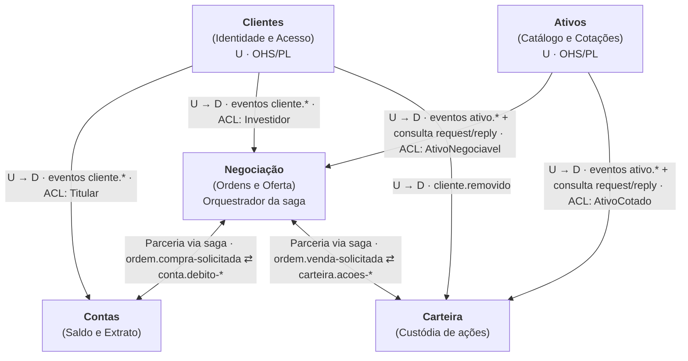
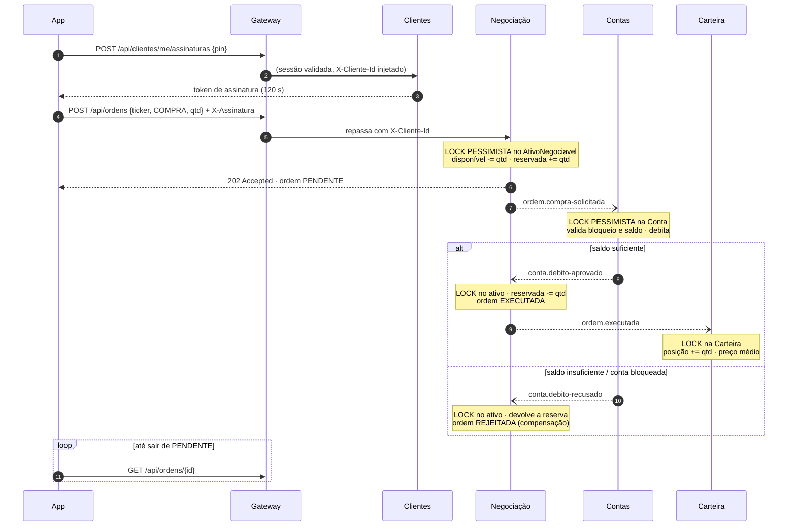

# Context Map — OrbitaPay

Este documento descreve os **bounded contexts** do OrbitaPay, como eles se relacionam e qual linguagem cada um publica. Cada contexto é um microserviço independente: processo próprio, porta própria, banco MongoDB próprio e modelo de domínio próprio. Os serviços não compartilham código nem banco. Entre si, eles só conversam por **mensageria (RabbitMQ)**. O **gateway** é a única porta de entrada do front-end e apenas delega as requisições HTTP. Ele nunca é usado para comunicação entre serviços.

## 1. Visão geral

```mermaid
flowchart LR
    APP["App React Native<br/>(Expo)"] -->|HTTP /api/**| GW["API Gateway<br/>:8080"]

    GW -->|/api/autenticacao, /api/clientes| CLI
    GW -->|/api/contas| CON
    GW -->|/api/ativos, /api/bolsas| ATV
    GW -->|/api/ordens, /api/ofertas| NEG
    GW -->|/api/carteiras| CAR

    subgraph CLI["Clientes :8081"]
        CLIdb[(orbita_clientes)]
    end
    subgraph CON["Contas :8082"]
        CONdb[(orbita_contas)]
    end
    subgraph ATV["Ativos :8083"]
        ATVdb[(orbita_ativos)]
    end
    subgraph NEG["Negociação :8084"]
        NEGdb[(orbita_negociacao)]
    end
    subgraph CAR["Carteira :8085"]
        CARdb[(orbita_carteira)]
    end

    MQ{{"RabbitMQ<br/>exchange orbita.eventos"}}
    CLI -. cliente.* .-> MQ
    ATV -. ativo.* .-> MQ
    NEG -. ordem.* .-> MQ
    CON -. conta.* .-> MQ
    CAR -. carteira.* .-> MQ
    MQ -. assinaturas .-> CON & NEG & CAR
```

## 2. Mapa de relacionamentos



Legenda: **U** = upstream, **D** = downstream, **OHS** = Open Host Service, **PL** = Published Language, **ACL** = Anti-Corruption Layer.

| Upstream | Downstream | Padrão | Como o downstream se protege |
|---|---|---|---|
| Clientes | Contas | OHS + PL (`cliente.*`) | ACL: o listener traduz a mensagem para `Titular` (nome e se está bloqueado) dentro da `Conta` |
| Clientes | Negociação | OHS + PL (`cliente.*`) | ACL: projeção `Investidor` (só `clienteId` e `bloqueado`) |
| Clientes | Carteira | OHS + PL (`cliente.removido`) | Só reage ao encerramento de cadastro |
| Ativos | Negociação | OHS + PL (`ativo.*`) + consulta síncrona por mensageria (`ativos.consultas`) | ACL: projeção `AtivoNegociavel` com dados próprios da negociação (ações disponíveis e reservadas) |
| Ativos | Carteira | OHS + PL (`ativo.*`) + consulta por mensageria | ACL: projeção `AtivoCotado` (cotação e câmbio para valorizar posições) |
| Negociação | Contas | Parceria (saga orquestrada pela Negociação) | Contrato de mensagens da saga; idempotência por `ordemId` |
| Negociação | Carteira | Parceria (saga orquestrada pela Negociação) | Contrato de mensagens da saga; idempotência por `ordemId` |

## 3. O mesmo conceito, modelos diferentes

O "ativo" (ação) existe em três contextos, e cada um guarda só o que precisa. É o equivalente ao exemplo em que o contexto de **Produto** é dono do cadastro completo e o contexto de **Venda** mantém o próprio `Produto`, reduzido ao que interessa para vender.

| Contexto | Classe | O que guarda | Quem é dono |
|---|---|---|---|
| Ativos | `Ativo` | ticker, empresa, setor, bolsa, cotação, histórico de 40 pontos, quantidade emitida | **Dono do dado** |
| Negociação | `AtivoNegociavel` | ticker, cotação, moeda, câmbio, quantidade emitida, **disponível**, **reservada**, negociável | Projeção + estado próprio (livro de oferta) |
| Carteira | `AtivoCotado` | ticker, nome, moeda, câmbio, cotação | Projeção somente-leitura |

O mesmo vale para o cliente:

| Contexto | Classe | O que guarda |
|---|---|---|
| Clientes | `Cliente` | nome, e-mail, CPF, PIN (hash PBKDF2), bloqueio, motivo e tentativas |
| Contas | `Conta.nomeTitular` / `titularBloqueado` | só o necessário para exibir o extrato e barrar saques |
| Negociação | `Investidor` | só `clienteId` e `bloqueado` |

Quando um contexto precisa de um dado que ainda não tem, ele **pergunta ao dono por mensageria** (request/reply na fila `ativos.consultas`), sem chamada HTTP entre serviços. Exemplos:
- a Negociação recebe uma ordem de um ticker que ainda não está na sua projeção;
- a Carteira valoriza uma posição de um ativo cuja cotação ainda não conhece.

## 4. Linguagem publicada (eventos)

Exchange: `orbita.eventos` (topic, durável). Toda mensagem carrega `eventoId`, `evento`, `mensagem` (texto legível) e `enviadoEm`, no mesmo formato dos DTOs de mensageria do projeto de referência.

| Routing key | Publicado por | Consumido por | Conteúdo principal |
|---|---|---|---|
| `cliente.cadastrado` | Clientes | Contas, Negociação | clienteId, nome, email, depositoInicial |
| `cliente.atualizado` | Clientes | Contas | clienteId, nome, email |
| `cliente.situacao-alterada` | Clientes | Contas, Negociação | clienteId, bloqueado, motivo |
| `cliente.removido` | Clientes | Contas, Negociação, Carteira | clienteId |
| `ativo.listado` / `ativo.atualizado` | Ativos | Negociação, Carteira | ticker, nome, setor, bolsa, moeda, câmbio, cotação, quantidadeEmitida |
| `ativo.removido` | Ativos | Negociação, Carteira | ticker |
| `ativo.cotacoes-atualizadas` | Ativos (a cada 3 s) | Negociação, Carteira | lista de (ticker, cotação) |
| `ordem.compra-solicitada` | Negociação | Contas | ordemId, clienteId, ticker, quantidade, valorTotal |
| `ordem.venda-solicitada` | Negociação | Carteira | ordemId, clienteId, ticker, quantidade |
| `ordem.executada` | Negociação | Contas (crédito da venda), Carteira (liquidação) | ordem completa |
| `ordem.rejeitada` | Negociação | Carteira (libera reserva de venda) | ordem completa + motivo |
| `conta.debito-aprovado` / `conta.debito-recusado` | Contas | Negociação | ordemId, valor ou motivo |
| `carteira.acoes-reservadas` / `carteira.acoes-insuficientes` | Carteira | Negociação | ordemId, quantidade ou motivo |

Consulta síncrona por mensageria: a fila `ativos.consultas` recebe `{ticker, solicitante}` e responde `{encontrado, ticker, nome, bolsa, moeda, cambio, cotacao, quantidadeEmitida}` via *direct reply-to*.

### Filas e ordenação

- **Eventos de ciclo de vida** (`cliente.#` e `ativo.#`) caem em **uma fila por contexto consumidor**, com consumidor único. Isso garante que "cadastrado → bloqueado" chegue na ordem certa.
- **Mensagens da saga** têm uma fila por tipo, com consumo concorrente, e a trava pessimista protege os agregados.
- Toda fila tem *dead-letter* para `orbita.eventos.mortos`, que encaminha para `<servico>.dlq`. Uma mensagem que falha 3 vezes (retry com backoff) vai para a DLQ em vez de entrar em loop.

## 5. Saga de compra de ações



A **venda** é simétrica:
1. A Negociação cria a ordem e publica `ordem.venda-solicitada`.
2. A Carteira trava a carteira do cliente e **reserva** as ações. Ela responde `carteira.acoes-reservadas` ou `carteira.acoes-insuficientes`.
3. Com a reserva confirmada, a Negociação trava o ativo, devolve as ações ao mercado e executa a ordem.
4. Em seguida publica `ordem.executada`: a Carteira liquida a reserva e a Conta credita o valor.

## 6. Lock pessimista no MongoDB

O projeto de referência usa `@Lock(PESSIMISTIC_WRITE)` com `SELECT ... FOR UPDATE` no H2. O MongoDB não tem esse recurso, então cada serviço que altera saldo ou quantidade implementa a trava explicitamente em `adapter/out/persistence/trava/TravaPessimistaMongo`:

1. **Adquirir:** um `findAndModify` atômico só modifica o documento se `trava` for nulo ou estiver expirado, e grava `trava = {dono: UUID, adquiridaEm, expiraEm}`. Se outra operação estiver com a trava, a thread espera com *backoff* e tenta de novo até `orbita.trava.espera-maxima-ms` (10 s, equivalente ao `LOCK_TIMEOUT=10000` do exemplo). Passado esse tempo, lança `TravaIndisponivelException` (HTTP 409).
2. **Salvar e liberar:** um `findAndReplace` filtrado por `trava.dono == UUID` grava o novo estado com `trava = null`. Salvar e liberar acontece em **uma única operação atômica**. Se a trava tiver expirado e outro processo tiver assumido, a gravação é recusada, o que evita *lost update*.
3. **Liberar sem alterar:** se a regra de negócio falhar (saldo ou oferta insuficiente), um `$unset` remove a trava.
4. **Expiração** (`expiracao-ms`, 30 s): evita *deadlock* se uma instância cair segurando a trava.

Como a trava fica **no banco**, ela funciona entre **várias instâncias** do mesmo serviço, que é o cenário do teste de concorrência do projeto de referência (duas instâncias disputando o mesmo estoque). A camada de aplicação usa a trava pela porta `OperacaoComTrava` e não sabe que existe MongoDB por trás.

Agregados protegidos:

| Serviço | Documento travado | Operações |
|---|---|---|
| Contas | `contas` (por clienteId) | depósito, saque, débito de compra, crédito de venda |
| Negociação | `ativos_negociaveis` (por ticker) | reserva de compra, confirmação, compensação, devolução de venda |
| Carteira | `carteiras` (por clienteId) | reserva de venda, liquidação de compra e venda, cancelamento |

## 7. Clean Architecture em cada serviço

```
com.orbitapay.<contexto>
├── domain           entidades, value objects, eventos e exceções (Java puro, sem Spring e sem Mongo)
├── application
│   ├── port/in      casos de uso (interfaces de entrada)
│   ├── port/out     repositórios, publicadores, catálogo (interfaces de saída)
│   ├── usecase      implementações dos casos de uso (classes puras, sem anotações)
│   └── dto
├── adapter
│   ├── in/web       controllers REST e DTOs HTTP
│   ├── in/messaging listeners RabbitMQ e mensagens de entrada (ACL)
│   ├── out/persistence  documentos Mongo, repositórios Spring Data, trava pessimista
│   └── out/messaging    publicadores e cliente request/reply
└── infrastructure   @Configuration que monta os casos de uso, topologia Rabbit, seed
```

As dependências sempre apontam para dentro: `infrastructure → adapter → application → domain`. Os casos de uso são instanciados em `CasosDeUsoConfig`, então o domínio e a aplicação não dependem do Spring.
