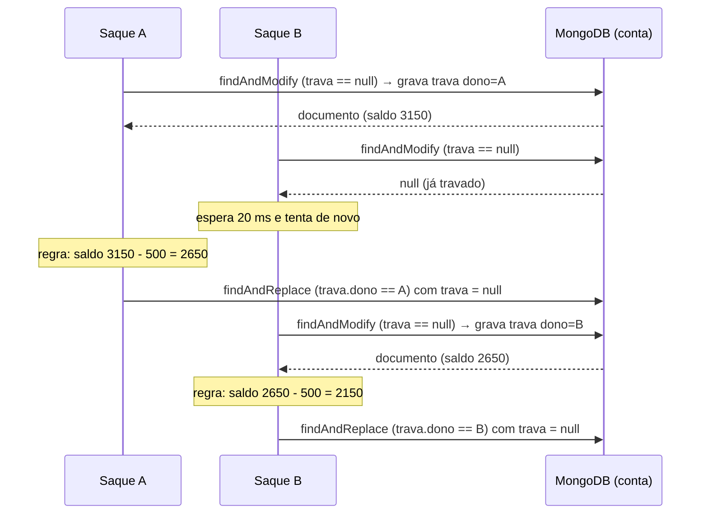

# Lock pessimista no MongoDB

## O problema

Várias requisições podem tentar alterar o mesmo dado ao mesmo tempo. Dois exemplos do OrbitaPay:

- **20 clientes** compram o ativo `ORBT3` no mesmo instante, mas só existem **10 ações**;
- o mesmo cliente dispara **10 saques de R$ 500** ao mesmo tempo numa conta com **R$ 3.150**.

Sem controle, duas operações leem o mesmo valor antigo ("ainda tenho 1 ação"), as duas aprovam e a última gravação apaga a outra (*lost update*). O resultado é vender mais ações do que existem ou deixar o saldo negativo.

A solução é o **lock pessimista**: quem vai alterar o dado primeiro o **trava**, e qualquer outra operação sobre o mesmo dado **espera** até ele ser liberado.

## Por que o MongoDB não resolve sozinho

Em um banco relacional, o lock pessimista é um recurso pronto:

```sql
SELECT * FROM conta WHERE cliente_id = ? FOR UPDATE;
```

No Spring Data JPA isso vira `@Lock(LockModeType.PESSIMISTIC_WRITE)`. A linha fica bloqueada até o fim da transação, e as outras transações esperam.

**O MongoDB não tem esse comando.** Ele não oferece um "SELECT FOR UPDATE" que deixe a aplicação segurar um documento enquanto executa a regra de negócio. O que ele garante é:

- cada **escrita em um único documento é atômica**;
- transações com vários documentos usam controle **otimista**: quando duas transações alteram o mesmo documento, uma delas **falha** com erro de conflito e precisa ser repetida. Ela não fica esperando a outra terminar.

Por isso o OrbitaPay **implementa o lock pessimista manualmente**, usando justamente a garantia que o MongoDB oferece: a escrita atômica em um documento.

## A ideia: um campo `trava` dentro do documento

Cada documento que precisa de proteção (conta, ativo negociável, carteira) tem um campo `trava`:

```json
{
  "clienteId": "6abd...",
  "saldo": 3150.00,
  "trava": {
    "dono": "c1f7e0b2-...",
    "adquiridaEm": "2026-10-01T02:38:41Z",
    "expiraEm": "2026-10-01T02:39:11Z"
  }
}
```

- `trava` vazio (`null`): o documento está **livre**;
- `trava` preenchido: alguém está alterando o documento. O `dono` é um identificador aleatório (UUID) gerado por quem travou;
- `expiraEm`: a trava vale por **30 segundos**. Se a instância que travou cair no meio da operação, o documento não fica preso para sempre (evita *deadlock*).

## As três operações

A classe `TravaPessimistaMongo` existe em cada serviço que precisa dela e tem três métodos.

### 1. `travar` — adquirir a trava

Um único comando `findAndModify` faz duas coisas **de forma atômica**: procura o documento **somente se estiver livre** (ou com a trava expirada) e grava a trava nele.

```java
Query contaLivre = new Query(Criteria.where("clienteId").is(clienteId).orOperator(
        Criteria.where("trava").isNull(),
        Criteria.where("trava.expiraEm").lt(agora)));
Update travar = new Update().set("trava", new TravaDocument(dono, agora, agora.plus(VALIDADE_DA_TRAVA)));

ContaDocument conta = mongo.findAndModify(contaLivre, travar, ContaDocument.class);
```

Como a busca e a gravação acontecem em uma só operação atômica, **duas requisições nunca conseguem travar o mesmo documento ao mesmo tempo**. Uma delas recebe o documento; a outra recebe `null`.

Quem recebeu `null` **espera 20 ms e tenta de novo**. Se passar de **10 segundos** sem conseguir, desiste e lança `TravaIndisponivelException`, que vira **HTTP 409 (Conflict)**.

### 2. `salvarELiberar` — gravar o resultado e soltar a trava

Depois de aplicar a regra de negócio (debitar o saldo, reservar ações…), o novo estado é gravado com `findAndReplace`, **filtrando pelo dono da trava**:

```java
Query minhaTrava = new Query(Criteria.where("clienteId").is(conta.clienteId()).and("trava.dono").is(dono));
mongo.findAndReplace(minhaTrava, conta);
```

O documento gravado vem com `trava = null`, então **salvar e liberar acontecem na mesma operação**. O filtro por `dono` garante que só quem travou consegue gravar. Se a trava tiver expirado e outra requisição tiver assumido, a gravação é recusada e nada é sobrescrito.

### 3. `liberar` — soltar a trava sem alterar nada

Se a regra de negócio falhar (saldo insuficiente, oferta esgotada…), a trava é removida com `$unset`, sem mexer no resto do documento:

```java
mongo.updateFirst(minhaTrava, new Update().unset("trava"), ContaDocument.class);
```

## Como o caso de uso usa a trava

Todo caso de uso que altera um documento protegido segue os mesmos passos, sempre visíveis no código:

```java
ContaTravada travada = trava.travar(clienteId);                // 1. trava
try {
    Conta conta = travada.conta();
    Lancamento saque = conta.sacar(new Dinheiro(valor), Instant.now());   // 2. regra de negócio
    trava.salvarELiberar(travada);                                // 3. salva e libera
    return new Comprovante(conta, saque);
} catch (RuntimeException erro) {
    trava.liberar(travada);                                       // em caso de erro, só libera
    throw erro;
}
```

A camada de aplicação só conhece a interface `TravaDeConta` (`travar`, `salvarELiberar`, `liberar`), declarada no módulo `domain`, e não sabe que existe MongoDB por trás. Quem a implementa é o `MongoContaRepository`, usando a `TravaPessimistaMongo`.

## Passo a passo com duas requisições



O saque B só lê o saldo **depois** que o saque A gravou o dele. Nenhuma atualização se perde.

## Onde a trava é usada

| Serviço | Documento travado | Chave | Operações protegidas |
|---|---|---|---|
| Contas | `contas` | `clienteId` | crédito de depósito, saque, débito de compra, crédito de venda |
| Negociação | `ativos_negociaveis` | `ticker` | reserva de compra, confirmação, devolução da reserva, devolução de venda |
| Carteira | `carteiras` | `clienteId` | reserva de venda, liquidação de compra e venda, cancelamento |

Como a trava fica **gravada no banco** e não na memória do processo, ela funciona mesmo com **várias instâncias** do mesmo serviço (para escalar, veja a observação no fim de [enderecos.md](enderecos.md)).

## Comparação com o banco relacional

| | Relacional (`SELECT ... FOR UPDATE`) | OrbitaPay no MongoDB |
|---|---|---|
| Quem implementa | o próprio banco | a aplicação (`TravaPessimistaMongo`) |
| Como trava | lock da linha dentro da transação | campo `trava` gravado com `findAndModify` atômico |
| Quem espera | o banco segura a segunda transação | a aplicação tenta de novo a cada 20 ms |
| Tempo máximo de espera | `lock_timeout` do banco | 10 s, depois HTTP 409 |
| Se o processo cair | o banco desfaz a transação | a trava expira sozinha em 30 s |
| Como libera | `COMMIT` ou `ROLLBACK` | `findAndReplace` (salva e libera) ou `$unset` (só libera) |

## Como ver funcionando

1. Suba o ecossistema: `docker compose up --build -d`.
2. Rode o teste de concorrência: `docker compose run --rm k6 run concorrencia.js`.
3. O teste dispara 20 compras simultâneas de 1 `ORBT3`. O resultado esperado num ambiente novo é **10 ordens executadas** (exatamente as 10 ações de `ORBT3`), **10 rejeitadas** e estoque final **0**, nunca negativo. O `teardown` do teste imprime o estoque inicial e o final e diz se bateu com o esperado.
4. Nos logs (`docker compose logs contas negociacao`) aparecem as etapas de cada trava: `ANTES DO LOCK`, `LOCK ADQUIRIDO`, `SAVE + LOCK LIBERADO` e `LOCK LIBERADO SEM ALTERACAO`.
